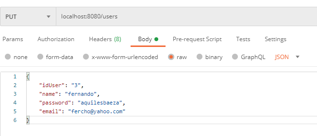

# Backend

# 2.1 Task Planner API

Innovación Y Emprendimiento Con Tecnologías De La Información 2021-1

## Generalidades

Este repositorio presenta el laboratorio de IETI, usando las herramientas Spring, Docker, Git y Gradle para su desarrollo.

### Prerrequisitos

Para poder usar este repositorio necesitara una herramienta como gradle en su computador 
https://gradle.org/

Instale git si aún no lo tiene instalado en su computador.

Lo puede encontrar y seguir los pasos de su instalación en:
https://git-scm.com/book/en/v2/Getting-Started-Installing-Git

Use un framework como Visual Studio Code, IntelliJ o alguno de su preferencia para más comodidad cuando use este repositorio.


### Preparando el espacio de trabajo

Cuando esté preparado abra un directorio en su computador donde quiera trabajar.

Ejecuta la consola de comandos desde el directorio y escribe en la línea de comandos

```
git clone https://github.com/Wasawsky/IETI-LAB6
```

Ingrese a la carpeta del proyecto y ejecute la consola de comandos, o usando un framework de desarrollo abra la carpeta.

### Funcionalidades

### PARTE 1





## Uso

Ejecute el comando de inicio en la carpeta raiz

```
gradle bootRun
```

## Construido con

* [Gradle](https://gradle.org/) - Compilacion de codigo abierto
* [GIT](https://git-scm.com/) - Environment Version Control System
* [Spring](https://spring.io/) - Framework para el desarrollo de aplicaciones
* [Docker](https://www.docker.com/) - Despliegue en contenedores de software

## Sobre el autor

*Michael Ballesteros*

Apasionado por el desarrollo y la gestión de sistemas

## Licencia

Para más información de la licencia ver LICENSE.md

Para más proyectos, Sígueme y encuentra mis repositorios :D
